# Dharma — System Diagram

```mermaid
graph TB
    subgraph Clients["Client Layer"]
        WEB["🌐 Web App\ndharma-lake.vercel.app"]
        EXT["🔌 Chrome Extension\nGmail DOM injection (MV3)"]
        ADDON["📧 Gmail Add-on\nGoogle Apps Script / clasp"]
    end

    subgraph Vercel["☁️ Vercel — Next.js 16 App (apps/web)"]
        AUTH["/api/auth/\nNextAuth v5 — Google OAuth login"]
        POLL["/api/gmail/poll\nPolling — processes new Gmail messages (all users)"]
        WEBHOOK["/api/gmail/webhook\nPub/Sub push — real-time Gmail notifications"]
        DRAFT["/api/emails/thread-draft\nAI draft generation (session / HMAC / GoogleBearer auth)"]
        SUGGEST["/api/suggest-times\nCalendar availability + streaming AI scheduling reply"]
        LABELS["/api/labels/\nLabel CRUD + AI inbox classification"]
        PREFS["/api/preferences/\nTone profile + scheduling preferences"]
        CAL["/api/calendar/*\nConnect/disconnect Google, Microsoft, Apple"]
        USER["/api/user/\nExtension token (HMAC) + me endpoint"]
    end

    subgraph Neon["🐘 Neon — PostgreSQL (Prisma ORM)"]
        USERS[(Users)]
        GCREDS[(GoogleCredential)]
        MCREDS[(MicrosoftCredential)]
        ACREDS[(AppleCredential\nAES-256-GCM encrypted)]
        SESSIONS[(Sessions / Accounts\nNextAuth adapter)]
        LABELM[(Labels + LabelRules)]
    end

    subgraph Anthropic["🤖 Anthropic — Claude API"]
        HAIKU["Claude Haiku\nclassify emails, label matching,\ntone profile, draft polish, schedule analysis"]
        SONNET["Claude Sonnet\nscheduling reply generation (streaming)"]
    end

    subgraph Google["Google Cloud"]
        GOAUTH["Google OAuth 2.0\nauthentication + calendar/gmail scopes"]
        GMAIL["Gmail API v1\nread, label, draft, history, watch"]
        GCAL["Google Calendar API\nfreebusy, events, Google Meet links"]
        PUBSUB["Cloud Pub/Sub\noptional real-time push (GOOGLE_PUBSUB_TOPIC)"]
    end

    subgraph Microsoft["Microsoft Azure"]
        MSAUTH["Microsoft OAuth\nlogin.microsoftonline.com"]
        MSGRAPH["Microsoft Graph API\n/me/calendarView — busy times only"]
    end

    subgraph Apple["Apple iCloud"]
        CALDAV["CalDAV Server\ncaldav.icloud.com — app-specific password"]
    end

    %% Client → API
    WEB -->|session cookie| AUTH
    WEB -->|session cookie| DRAFT & SUGGEST & LABELS & PREFS & CAL & USER
    EXT -->|HMAC extension token| DRAFT
    EXT -->|HMAC extension token| USER
    ADDON -->|GoogleBearer token| DRAFT

    %% Auth flow
    AUTH -->|Google OAuth redirect| GOAUTH
    AUTH -->|store session + account| SESSIONS
    AUTH -->|store token, register Gmail Watch| GCREDS

    %% Polling / Webhook
    POLL -->|fetch history delta| GMAIL
    POLL -->|classify + label| HAIKU
    POLL -->|update historyId| USERS
    WEBHOOK -->|verify push| GMAIL
    PUBSUB -.->|push notification| WEBHOOK

    %% Draft / Suggest
    DRAFT -->|fetch thread messages| GMAIL
    DRAFT -->|classify + polish draft| HAIKU
    DRAFT -->|create draft| GMAIL
    SUGGEST -->|freebusy query| GCAL
    SUGGEST -->|calendarView| MSGRAPH
    SUGGEST -->|PROPFIND| CALDAV
    SUGGEST -->|streaming reply| SONNET

    %% Labels
    LABELS -->|AI label match| HAIKU
    LABELS -->|create/apply Gmail labels| GMAIL
    LABELS -->|store rules| LABELM

    %% Preferences
    PREFS -->|fetch sent emails| GMAIL
    PREFS -->|generate tone profile| HAIKU
    PREFS -->|store tone + scheduling prefs| USERS

    %% Calendar connect
    CAL -->|OAuth flow| MSAUTH
    CAL -->|validate + PROPFIND| CALDAV
    CAL -->|store credentials| GCREDS & MCREDS & ACREDS
```



---

## Service Reference

| Service | Provider | Purpose | Key Env Vars | Notes |
|---|---|---|---|---|
| **Hosting / Functions** | Vercel | Hosts the Next.js app; serverless API routes | — | `maxDuration=30` on `/thread-draft`; `waitUntil` for post-login Gmail Watch |
| **PostgreSQL** | Neon | Stores users, credentials, sessions, labels | `DATABASE_URL` | Prisma ORM; connection pooling via Neon pooler endpoint |
| **AI — classify, polish, tone** | Anthropic (Claude Haiku) | Email classification, label matching, tone profile generation, draft polishing, schedule analysis | `ANTHROPIC_API_KEY` | Raw fetch (no SDK); model: `claude-haiku-4-5-20251001` |
| **AI — scheduling reply** | Anthropic (Claude Sonnet) | Streaming scheduling reply generation in `/api/suggest-times` | `ANTHROPIC_API_KEY` | model: `claude-sonnet-4-20250514`; streaming response |
| **Google OAuth / Login** | Google Cloud | User authentication at sign-in | `GOOGLE_CLIENT_ID`, `GOOGLE_CLIENT_SECRET` | NextAuth v5 Google provider; scopes include `gmail.modify` + `calendar.events` |
| **Gmail API** | Google Cloud | Read inbox, apply labels, create drafts, fetch history, register push Watch | `GOOGLE_CLIENT_ID`, `GOOGLE_CLIENT_SECRET` | `googleapis ^144`; history polling or Pub/Sub push |
| **Google Calendar API** | Google Cloud | Freebusy queries for availability, create events with Google Meet | `GOOGLE_CLIENT_ID`, `GOOGLE_CLIENT_SECRET` | Used in `/api/suggest-times` and `/api/calendar/google/schedule` |
| **Cloud Pub/Sub** | Google Cloud | Real-time push notifications when new Gmail messages arrive | `GOOGLE_PUBSUB_TOPIC`, `PUBSUB_VERIFICATION_TOKEN` | Optional; falls back to polling if not configured |
| **Microsoft OAuth + Graph** | Microsoft Azure | Connect Outlook/Exchange calendar for availability | `MICROSOFT_CLIENT_ID`, `MICROSOFT_CLIENT_SECRET`, `MICROSOFT_REDIRECT_URI` | Stores token in `MicrosoftCredential`; read-only calendar scopes |
| **Apple CalDAV** | Apple iCloud | Connect iCloud Calendar for availability | `APPLE_CREDENTIAL_ENCRYPTION_KEY` | App-specific password; stored AES-256-GCM encrypted; `tsdav ^2.0.11` |
| **NextAuth v5** | Vercel / Prisma | Session management, JWT, OAuth callback handling | `NEXTAUTH_SECRET`, `NEXTAUTH_URL` | `@auth/prisma-adapter`; userId in JWT sub |
| **Chrome Extension** | Chrome / Vercel | Injects "Draft reply" + "Polish draft" buttons into Gmail web | — | HMAC token from `/api/user/extension-token`; no build step (MV3 raw JS) |
| **Gmail Add-on** | Google Apps Script | Sidebar panel in Gmail with draft/polish/tone controls | — | Deployed via `clasp`; calls Dharma API with `GoogleBearer` token |

---

## Data Flow Summary

```
New Email Arrives
  → Gmail Pub/Sub push  (if GOOGLE_PUBSUB_TOPIC set)
  → OR polling script every 30s  (apps/web/scripts/poller.mjs → /api/gmail/poll)
  → Claude Haiku: is this a scheduling request?
  → If yes: label it, optionally auto-draft a reply

User requests a reply draft
  → Chrome Extension / Gmail Add-on / Web UI
  → /api/emails/thread-draft
  → Claude Haiku: classify + generate draft
  → Gmail API: save as draft

User requests scheduling times
  → /api/suggest-times
  → MultiProvider: query Google Cal + Outlook + Apple CalDAV in parallel
  → Claude Sonnet: stream back available time chips + AI email text
  → Gmail API: create scheduled invite event (on confirm)
```
